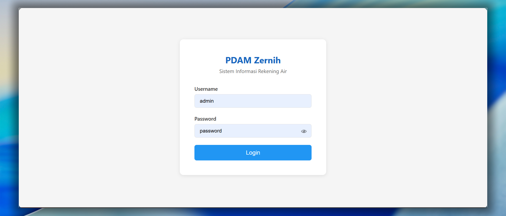
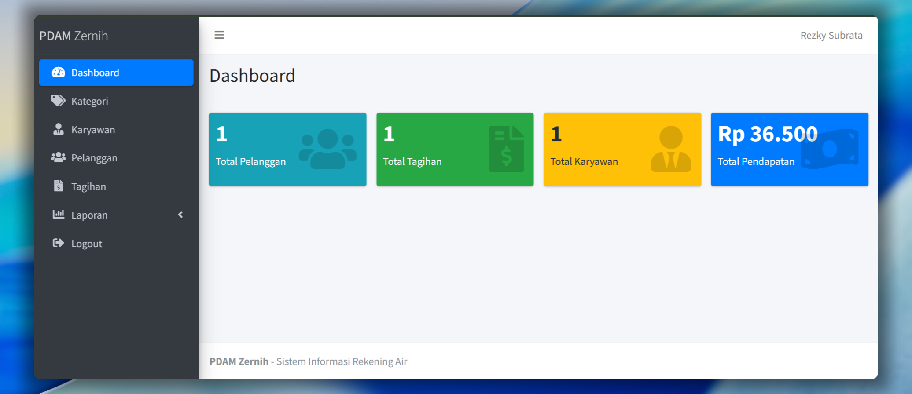
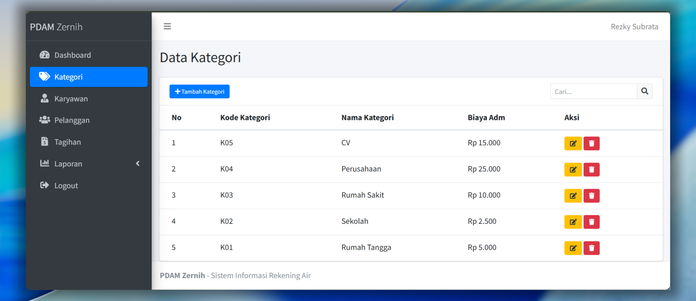
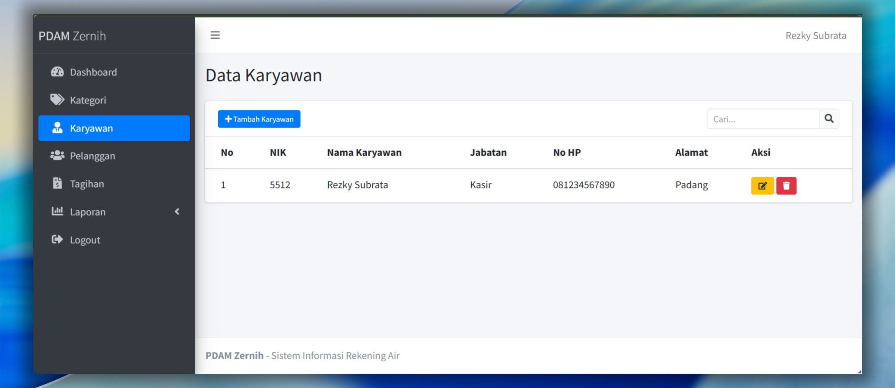
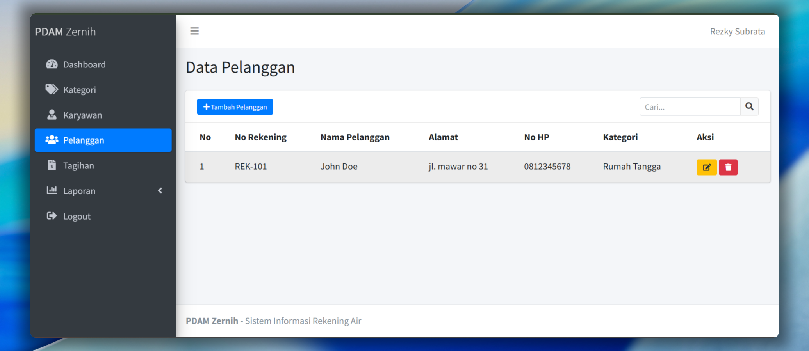
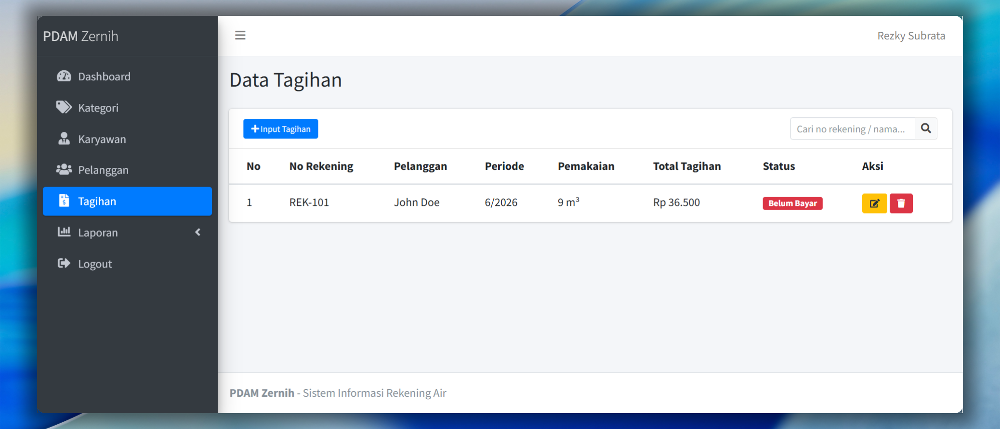
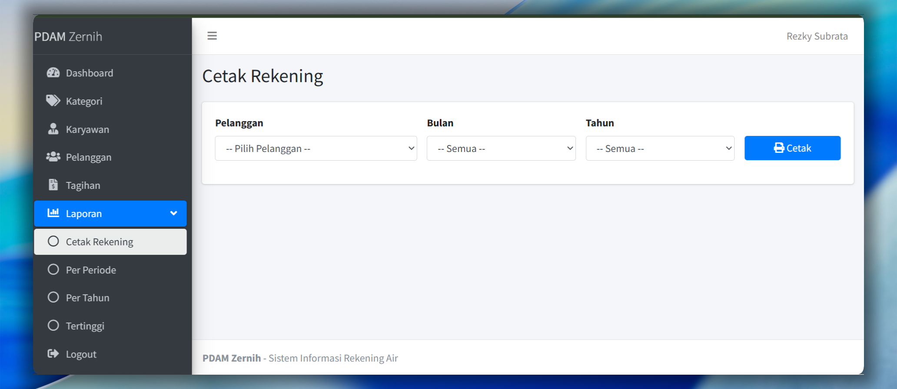

# Sistem Informasi PDAM Zernih

## Rules Commit

Format: `tipe: deskripsi singkat`

### Tipe Commit

- `feat:` - Menambahkan fitur baru
- `fix:` - Memperbaiki bug

### Contoh

```
feat: tambah form input tagihan
feat: cetak laporan per periode
fix: perbaiki hitungan pemakaian air
fix: pagination tidak muncul
```

## Progress

- [x] Setup struktur project
- [x] Database SQL
- [x] Koneksi database
- [x] Login (AJAX + show password)
- [x] Dashboard (AdminLTE)
- [x] Fix sidebar & layout AdminLTE
- [x] CRUD Kategori
- [x] CRUD Karyawan
- [x] CRUD Pelanggan
- [x] Input Tagihan (hitung otomatis)
- [x] Pagination & Searching
- [x] Cetak Rekening per Pelanggan
- [x] Laporan Pendapatan per Periode
- [x] Laporan Pendapatan per Tahun
- [x] Laporan Pendapatan Tertinggi
- [x] Export Excel
- [x] Logout

## Screenshot

### Login


### Dashboard


### Kategori


### Karyawan


### Pelanggan


### Tagihan


### Laporan

